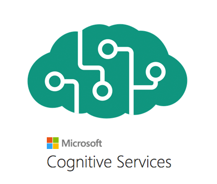
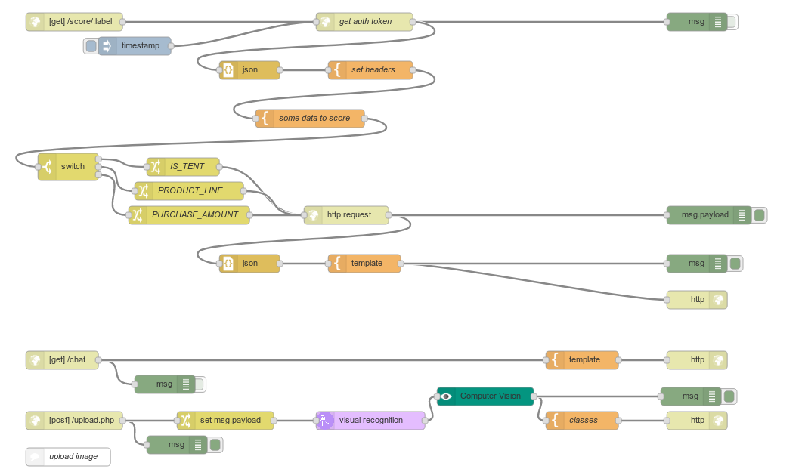
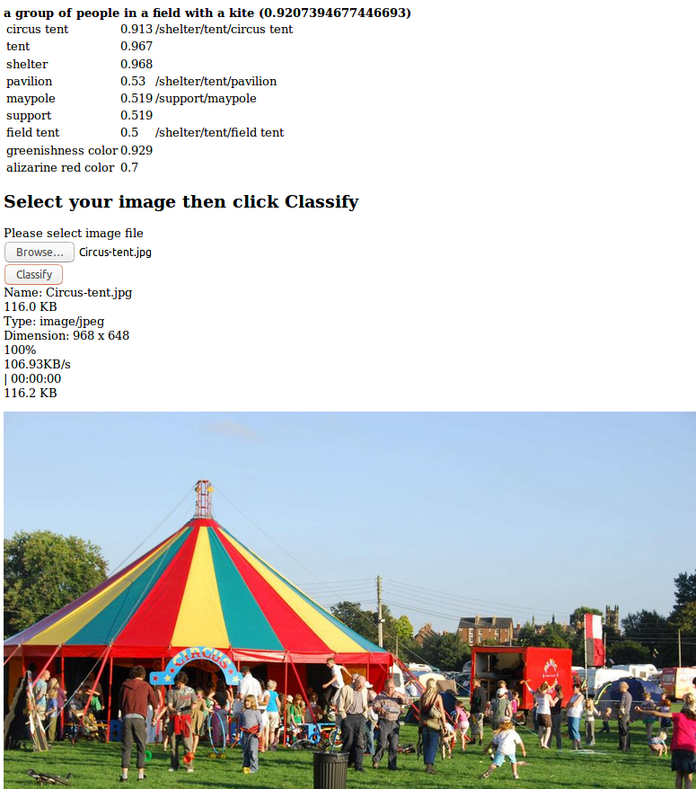

# Welcome to the NodeRED and AI workshop

In this workshop, you will be building Node-RED flows to interact with AI services in a number of environments:

+ invoking Watson Cognitive services in IBM Cloud
+ invoking your own Machine learning models, running in Watson Studio
+ servicing requests from a Watson Studio Jupyter notebook to update a real-time models
+ invoking 3rd party AI services - e.g. Azure translate

## Prerequisites

Use of the Watson Studio, and Cognitive services also requires an IBM Cloud account.  A "Lite" account will be sufficient.

With an IBM Cloud account, you will be able to run a NodeRED application instance. You can also run NodeRED locally on your laptop or Raspberry Pi (Windows, Mac, Linux - as long as it will run a supported
[Node.js V8 LTS](https://nodejs.org/download/release/latest-v8.x/)
environment)

# IBM Cloud account

If you have already established an IBM Cloud account, please use that - if not, sign up at 
[IBM Cloud registration](https://www.ibm.com/cloud/lite-account/lite-account).

# Local NodeRED installation
Please follow system specific guides at
[NodeRED installations](https://nodered.org/docs/getting-started/installation).

Once installed, to more easily use the Watson Cognitive services, installed the `node-red-node-watson` npm package, using one of the methods detailed at [Adding nodes](https://nodered.org/docs/getting-started/adding-nodes).

### IBM Cloud NodeRED instances

If you have, or register for, an IBM Cloud Lite account, you will have sufficient runtime memory entitlement to run one NodeRED instance, based on the [Node-RED starter](https://console.bluemix.net/catalog/starters/node-red-starter).

This creates a Node SDK runtime application, _and_ an instance of the Cloudant NoSQL database; you can only have _one instance of the Cloudant database_ under the Lite plan -- effectively, this means you can only create and run one NodeRED starter application with your Lite account. ** Worry not! ** as NodeRED allows for a great deal of flexibility in supoorting mutliple flows, and micro-applications within a single instance.

### Watson Studio setup

1 Create a Watson Studio service instance from the
[IBM Cloud AI services catalog](https://console.bluemix.net/catalog/?category=ai)

## Reference code patterns and tutorials

There are complete tutorials for each of the main activities:

### Watson Cognitive
A very comprehensive set of examples of exploiting Watson Cognitive services via NodeRED is available at 
[Emma Dawson's node-red-labs github repository](https://github.com/watson-developer-cloud/node-red-labs/tree/master/basic_examples).

### Creating a machine learning service in Watson Studio
An example of setting up a scoring service to predict customers' propensity to buy particular retail offerings is available at
[developerWorks TV](https://developer.ibm.com/tv/ibm-watson-machine-learning-build-a-logistic-regression-model/).
This shows how to create the scoring service - you can then learn how to invoke that service from NodeRED

### Invoking 3rd party services
Since NodeRED is a n open source project, the community develops new nodes as needed - earlier this year, a package for interacting with 
[Microsoft Azure cognitive services](https://azure.microsoft.com/en-gb/services/cognitive-services/)
was created.
This package - `node-red-contrib-cognitive-services` - makes it quick and easy to invoke these services from within a NodeRED flow.
An example flow 
[Node-Red Azure Computer Vision Photo Recognition Complete Example](https://flows.nodered.org/flow/ae3ba3a1403f25e9a465ae95c509da26)
shows how to invoke the image classifier.
You will need an Azure account, and the necessary service subsciption keys, to be able to try this out.

### Triggering real-time execution model updates
Using IOT historical data, this
[Cognitive IOT tutorial](https://developer.ibm.com/tutorials/iot-cognitive-iot-app-machine-learning/)
shows how to interpret events, identify anomalies, and update runtime processing models to accomodate new knowledge.

## What you'll end up with
It's always good to know what you will get at the end. This workshop will lead to a web application that previews and classifies images with IBM Watson and Microsoft Azure Cognitive (for demo purposes, we'll use pictures of a tent), and demonstrates using a Machine Learning scoring service to predict a prospective customer's likelihood of buying a particular product (for demo purposes, a tent)

## On to the Activities ...
1. [Watson Nodered 101](https://github.com/IBMDeveloperUK/Node-RED-Watson-101)
1. [Watson Cognitive services - a visual recognition sample](watson-cognitive-nodered.md)
1. [Watson Machine Learning scoring service](watson-studio-ml-service.md)
1. [Azure Cognitive services - simple examples](azure-cognitive-nodered.md)
1. [Watson Studio notebook anomaly detection](https://developer.ibm.com/tutorials/iot-cognitive-iot-app-machine-learning)
