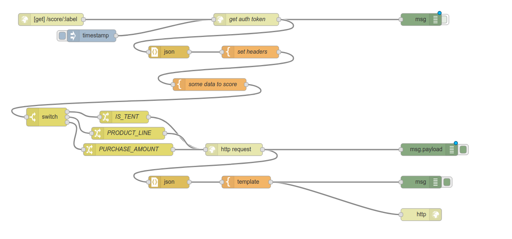
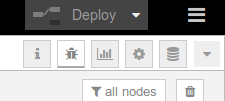
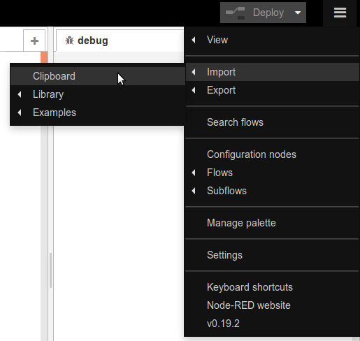
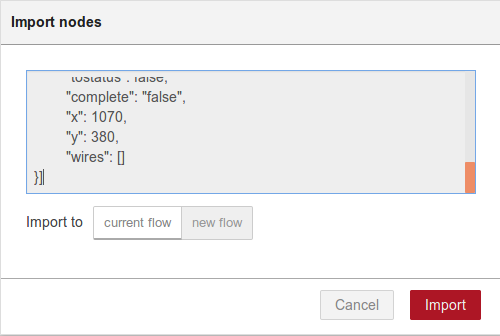
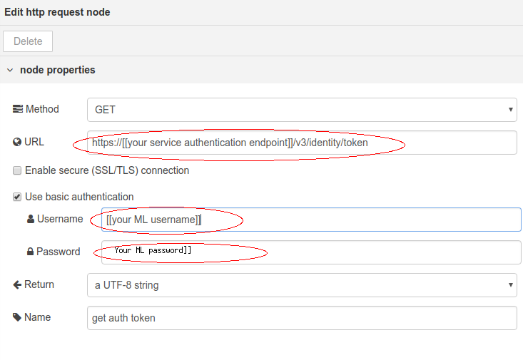
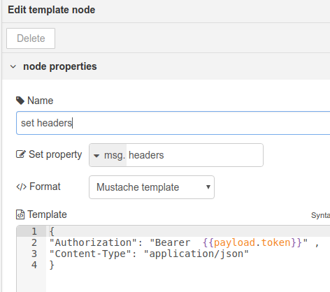
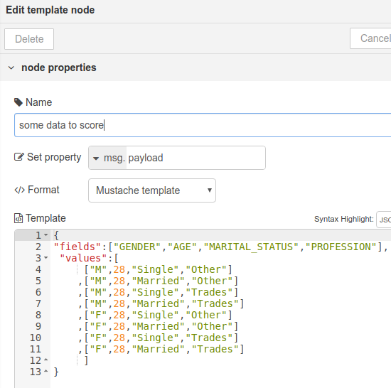
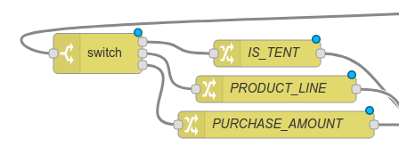
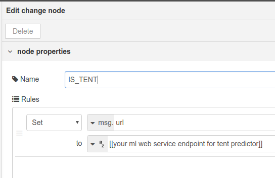
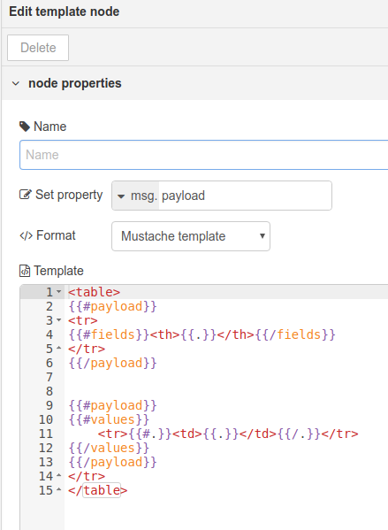

# Invoking ML scoring services with NodeRED

Now that the ML scoring has been defined, the process of invoking this from NodeRED os delightfully simple:

The following flow uses the "out-of-the-box" services of the NodeRED installation - meaning it can be used in any runtime environment.

## Import the flow
You will find the flow discussed here can be imported into your NodeRED environment from [nodered-scoring-flow.json](nodered-scoring-flow.json).

Simply open the above link, and copy the content of the file to the clipboard.

Then, from the NodeRED menu , open the `Import` --> `Clipboard` option 

Paste the flow from the clipboard into the `Import nodes` window 
and click `Import`

This will let you drop the flow onto the NodeRED editing canvas.

## Breaking it down into stages:

1. the starting node `/score/:label` is itself an endpoint which can be invoked from a browser, curl, etc. This triggers NodeRED into calling the scoring service.
there is a corresponding `http` response node at the bottom right of the flow - this is where response data from NodeRED is returned to the caller.

1. next is the node which invokes the ML authentication service, to obtain an access token

You will need to configure this with the Authorization endpoint URL, username and password for your ML service instance.
The response from this will be a string containing the access token.

1. the next two nodes extract the token via JSON, and generate the authorization header for the actual ML scoring request.

1. now some sample data is prepared for sending to the ML scorer - this could also be sourced from the incoming request to NodeRED or retrieved from a database or file.

[flow file sample](nodered-scoring-flow.json)

1. the next two node sets are to support scoring different labels, which will of course require different scoring web services.
 The `IS_TENT` node needs to be configured with your scoring endpoint URL.

1. the `http request` node does not need to configured, as the target url, and necessary headers have been built during the earlier stages in the flow, and will be passed to it.

1. the next two nodes convert the scoring response to JSON, and then build a simple html response, formatted as a simple table.

The resulting output from invoking your NodeRED application `/score/tent` route should look similar to this:

The powerful template node uses the [Mustache template engine](http://mustache.github.io/mustache.5.html) which can be used to generate HTML, JSON, or any other text output from an incoming JSON object.

Think about what would be needed to produce a JSON response instead of HTML.
